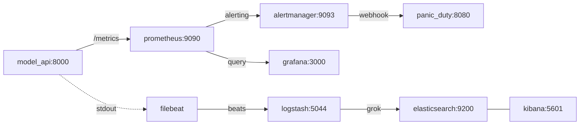

# ML Monitoring Demo

This guide explains how the demo works step by step, what each tool observes and why, and how every design decision connects to the concepts in the article.

---

## Table of contents

1. [What does the demo simulate?](#1-what-does-the-demo-simulate)
2. [Architecture: services and how they communicate](#2-architecture-services-and-how-they-communicate)
3. [Access to each service](#3-access-to-each-service)
4. [The prediction API (model_api)](#4-the-prediction-api-model_api)
5. [Prometheus: the metrics collector](#5-prometheus-the-metrics-collector)
6. [Grafana: the ML dashboard](#6-grafana-the-ml-dashboard)
7. [PanicDuty: the alert receiver](#7-panicduty-the-alert-receiver)
8. [The logs pipeline: Filebeat → Logstash → Elasticsearch](#8-the-logs-pipeline-filebeat--logstash--elasticsearch)
9. [Kibana: log exploration and dashboard](#9-kibana-log-exploration-and-dashboard)
10. [Relation to the article](#10-relation-to-the-article)

---

## 1. What does the demo simulate?

The demo is inspired by the article [Monitoring Machine Learning Models in Production](https://christophergs.com/machine%20learning/2020/03/14/how-to-monitor-machine-learning-models/) by Christopher GS. The article's core idea is that monitoring an ML system is not the same as monitoring traditional software.

What the article calls the central premise — **"once you deploy your model, the work has just begun"** — becomes visible here. The model behaves correctly when input data resembles the training data. When data changes — even though the code does not — the model starts producing out-of-range results, errors, high latency. The demo makes that happen in a controlled and observable way.

The simulated scenario is a **house price prediction API** deployed in production. There is no real machine learning model; there is a deterministic formula that mimics one's behavior. This is intentional: it lets us control exactly what goes wrong and when, so the monitoring tools can detect it.

We assume a regression model was trained to estimate house prices. The model expects three input features:

- `square_meters` — surface area in square meters
- `bedrooms` — number of bedrooms
- `neighborhood` — neighborhood (`suburb`, `downtown`, `rural`, `industrial`)

The model was trained on data where typical houses are between 80 and 260 m², between 1 and 5 bedrooms, and neighborhoods are split among `suburb` (≈50%), `downtown` (≈25%) and `rural` (≈25%). Importantly, the `industrial` neighborhood **does not appear in the training data** — it only shows up later, during anomaly windows, as an example of an unknown category.

### What happens every 60 seconds

The API alternates automatically between two modes in 60-second cycles:


In the **normal** window, data is representative of training and everything works fine.
In the **anomaly** window, the system injects real problems: out-of-distribution inputs, high latency, HTTP 500 errors, and missing features. This fires alerts in Prometheus and makes the degradation visible in Grafana and Kibana.

---

## 2. Architecture: services and how they communicate

### Flow diagram

All services live on the same Docker network `monitor_net` and see each other by name.



### End-to-end flow, step by step

**Core:**

1. The Model API starts.
2. It begins generating synthetic traffic in the background.
3. It exposes metrics via `/metrics`.
4. Prometheus scrapes those metrics every 5 seconds.
5. Grafana reads data from Prometheus and renders the dashboard.
6. Prometheus continuously evaluates alert rules.

**Alerts:**

7. Alertmanager receives firing alerts from Prometheus.
8. Alertmanager sends a webhook to PanicDuty.
9. PanicDuty displays the active incident in its UI.

**Logs:**

10. The Model API also writes one plain-text free-form line per prediction to stdout (format like `2026-05-01 12:00:00.000 INFO [model_api] req=abc endpoint=/predict status=200 latency=42.10ms ...`).
11. Docker captures stdout into the container's log file.
12. Filebeat reads those files via Docker autodiscover and forwards each line (unparsed) to Logstash on TCP 5044.
13. Logstash parses the plain text with `grok` to reconstruct the JSON structure and normalizes types.
14. Logstash sends the resulting document to Elasticsearch as `model-api-logs-YYYY.MM.DD`.
15. Kibana (UI on port 5601) reads from Elasticsearch and lets you filter individual events in Discover.

### Services table

| Service | Image / Build | Exposed port | Role |
|---|---|---|---|
| **model_api** | local build | 8000 | Prediction API + synthetic traffic generator; exposes `/metrics` (scraped by Prometheus) and emits plain-text logs (consumed by Filebeat) |
| **prometheus** | prom/prometheus:v2.45.0 | 9090 | Metrics collection and alert evaluation |
| **alertmanager** | prom/alertmanager:v0.25.0 | 9093 | Alert grouping and routing |
| **panic_duty** | local build | 8080 | Alert webhook receiver + UI |
| **grafana** | grafana/grafana:10.0.3 | 3000 | Visual metrics dashboard |
| **elasticsearch** | elastic/elasticsearch:8.17.0 | 9200 | Log database |
| **kibana** | elastic/kibana:8.17.0 | 5601 | Log search and visualization UI |
| **logstash** | elastic/logstash:8.17.0 | 9600 (stats API), 5044 (internal port, receives from Filebeat) | Log parser |
| **filebeat** | elastic/filebeat:8.17.0 | — | Docker container log collector |
| **kibana-init** | curlimages/curl | — | Creates the data view and loads 2 Lens panels + 1 dashboard in Kibana (runs once) |

---

## 3. Access to each service

When the demo runs locally:

| Service | URL | What you can see |
|---|---|---|
| **Grafana** (home) | http://localhost:3000 | Grafana home page |
| **Grafana — ML System Dashboard** | http://localhost:3000/d/ml-system | Real-time ML metrics dashboard (direct link) |
| **Prometheus** (home) | http://localhost:9090 | Raw metrics, alert rules, targets |
| **Prometheus Alerts** | http://localhost:9090/alerts | State of each alert (inactive/pending/firing) |
| **Prometheus Targets** | http://localhost:9090/targets | Scrape status (UP/DOWN) toward the API |
| **Alertmanager** | http://localhost:9093 | Active alerts grouped |
| **PanicDuty** | http://localhost:8080 | UI with alerts firing right now |
| **API (Swagger UI)** | http://localhost:8000/docs | Interactive API docs (predict, health, metrics) |
| **Kibana** (home) | http://localhost:5601 | Kibana home page |
| **Kibana — Discover (logs)** | http://localhost:5601/app/discover | Parsed log listing with the `model-api-logs` data view (direct link) |
| **Kibana — ML Drift Investigation Dashboard** | http://localhost:5601/app/dashboards#/view/ml-derived-fields-dashboard | Dashboard with 2 Lens panels (predictions with missing features, top-20 outlier predictions) |

### Access from a public deployment

When the demo runs in the cloud, the 6 tools listed in the `Caddyfile` (the reverse-proxy config that routes each subdomain to the matching internal service) sit behind HTTPS subdomains with automatic Let's Encrypt certs.

URLs point to the Elastic IP of the current deployment (`3-226-31-220` in dashed format, which `sslip.io` resolves via wildcard DNS to `3.226.31.220`).

| Service | Public URL |
|---|---|
| **Grafana** (home) | [https://grafana.3-226-31-220.sslip.io](https://grafana.3-226-31-220.sslip.io) |
| **Grafana — ML System Dashboard** | [https://grafana.3-226-31-220.sslip.io/d/ml-system](https://grafana.3-226-31-220.sslip.io/d/ml-system) |
| **Prometheus** (home) | [https://prometheus.3-226-31-220.sslip.io](https://prometheus.3-226-31-220.sslip.io) |
| **Prometheus Alerts** | [https://prometheus.3-226-31-220.sslip.io/alerts](https://prometheus.3-226-31-220.sslip.io/alerts) |
| **Prometheus Targets** | [https://prometheus.3-226-31-220.sslip.io/targets](https://prometheus.3-226-31-220.sslip.io/targets) |
| **Alertmanager** | [https://alertmanager.3-226-31-220.sslip.io](https://alertmanager.3-226-31-220.sslip.io) |
| **PanicDuty** | [https://panicduty.3-226-31-220.sslip.io](https://panicduty.3-226-31-220.sslip.io) |
| **API (Swagger UI)** | [https://api.3-226-31-220.sslip.io/docs](https://api.3-226-31-220.sslip.io/docs) |
| **Kibana** (home) | [https://kibana.3-226-31-220.sslip.io](https://kibana.3-226-31-220.sslip.io) |
| **Kibana — Discover (logs)** | [https://kibana.3-226-31-220.sslip.io/app/discover](https://kibana.3-226-31-220.sslip.io/app/discover) |
| **Kibana — ML Drift Investigation Dashboard** | [https://kibana.3-226-31-220.sslip.io/app/dashboards#/view/ml-derived-fields-dashboard](https://kibana.3-226-31-220.sslip.io/app/dashboards#/view/ml-derived-fields-dashboard) |

---

## 4. The prediction API (model_api)

### What the "model" is

There is no real ML model. The "prediction" is this formula:

```python
base_price       = square_meters * 1800
bedroom_adj      = bedrooms * 12000
multiplier       = NEIGHBORHOOD_MULTIPLIERS[neighborhood]
noise            = random.uniform(-15000, 15000)

prediction = (base_price + bedroom_adj) * multiplier + noise
```

With these neighborhood multipliers:

| Neighborhood | Multiplier | Interpretation |
|---|---|---|
| `rural` | 0.82 | Cheapest |
| `suburb` | 1.00 | Base reference |
| `downtown` | 1.25 | 25% more expensive than suburb |
| `industrial` | 1.55 | Most expensive (high-demand area) |

A 120 m² house with 3 bedrooms in `suburb` produces:
```
(120 × 1800 + 3 × 12000) × 1.0 + noise = (216000 + 36000) × 1 + noise ≈ $252,000
```

### The anomaly cycle: how it works

The function `is_anomaly_window()` uses modular arithmetic over the elapsed time since startup:

```python
ANOMALY_INTERVAL_SECONDS = 30   # time in normal mode
ANOMALY_DURATION_SECONDS  = 30  # time in anomaly mode
cycle_length = 30 + 30 = 60     # full cycle

def is_anomaly_window() -> bool:
    elapsed = time.monotonic() - app_state["start_time"]
    return (elapsed % 60) >= 30
```

This produces a square wave: the first 30 seconds of the cycle are normal, the next 30 are anomalous, and it repeats indefinitely.

### NORMAL window — expected behavior

| Aspect | Value |
|---|---|
| `square_meters` | 80–260 m² (small-to-medium distribution) |
| `bedrooms` | 1–5 (always present) |
| `neighborhood` | 50% `suburb`, 25% `downtown`, 25% `rural` |
| Extra latency | none (only the base computation) |
| Error rate | 0% |
| Predictions | ~$113k–$675k (reasonable range) |

### ANOMALY window — what gets injected

| Aspect | Value during anomaly | Why it's a problem |
|---|---|---|
| `square_meters` | 320–580 m² | Out of training range (80–260 m²) |
| `bedrooms` | None (35% probability) or `random.randint(1, 7)` | Missing feature (35%) or out of training range (1-5) when it lands on 6-7 |
| `neighborhood` | 75% `industrial` | Unusual neighborhood (training was mostly `suburb`) |
| Extra latency | +450 to +850 ms additional | The API "stalls" under anomalous data |
| Error rate | 70% of requests fail with HTTP 500 | Real production-style errors |
| Added price | +$180k to +$420k random | Predictions skyrocket |

#### Imputation when `bedrooms` is missing

When `bedrooms` is missing in the request (the only feature the synthetic generator omits, 35% of the time during anomaly), the model imputes the gap with the **training-set median** (`bedrooms=3`) and predicts normally.

#### Combined result during the anomaly

```
Anomalous prediction = ((large_sqm × 1800) + (bedrooms × 12000)) × 1.55 + extra
                     = ((450 × 1800) + (3 × 12000)) × 1.55 + 300000
                     ≈ ($810,000 + $36,000) × 1.55 + $300,000
                     ≈ $1,611,000
```

This crosses the `PredictionDriftDetected` alert threshold (> $600,000) within seconds.

### The three background threads

When the API starts, it launches three threads that run continuously:

**Thread 1 — `generate_traffic`:** Generates internal synthetic requests against the API itself at the rate of `BASE_RPS` (8 requests/second by default). This keeps Grafana populated with data without anyone calling the API externally.

**Thread 2 — `sample_resources`:** Every second, samples CPU (`psutil`), RSS memory, and disk usage, and publishes them as Prometheus Gauges.

**Thread 3 — `auto_bump_version`:** Every 900 seconds (15 min) simulates a model "redeploy": bumps the version, updates the `ml_model_info` metric, and calls the Grafana API to create an annotation visible on the dashboard.

### Log format

The API uses a `PlainTextFormatter` that emits each event as a free-form text line with `key=value` pairs. Logstash parses those lines with `grok` and turns them into structured documents before indexing them in Elasticsearch.

A successful prediction log looks like:

```
2025-05-03 12:34:56.789 INFO [model_api] req=a1b2c3d4e5f60718293a4b5c6d7e8f90 endpoint=/predict
status=200 latency=34.12ms model=v1.1.0-demo anomaly=false internal=true
sqm=142 br=3 nbhd=suburb missing=none prediction=267540.50
summary="prediction within expected ranges"
```

An error log during anomaly:

```
2025-05-03 12:35:10.321 ERROR [model_api] req=e5f6g7h8a1b2c3d4e5f6071829a4b5c6 endpoint=/predict
status=500 latency=612.88ms model=v1.1.0-demo anomaly=true internal=true
sqm=452 br=2 nbhd=industrial msg="Prediction failed during an anomaly window.
Anomalous signals: latency was 612ms (typical 15-50ms); square_meters was 452,
unusually large (typical 80-260); neighborhood was 'industrial', unusual
(typical 'suburb' or 'rural'). Cause: Synthetic anomaly triggered while scoring the model."
```

---

## 5. Prometheus: the metrics collector

Prometheus is the component in charge of metrics in the stack. The `prometheus.yml` file defines a single `scrape_config` pointing at `model_api:8000/metrics` with a `scrape_interval` of **5 seconds**: every 5s, Prometheus does a GET to that endpoint, receives the full metrics dump in exposition format (text-based key=value), and adds each time series with a timestamp from the moment of the scrape. Over that data it evaluates alert rules and forwards firing alerts to Alertmanager.

### Prometheus metric types

Before listing the metrics, it's worth understanding the four types:

- **Counter:** Only goes up. Counts cumulative events. For rates, you use `rate()` which computes the derivative.
- **Gauge:** Goes up and down. Represents an instantaneous value (CPU%, memory).
- **Histogram:** Records observations into buckets. Produces three series: `_count`, `_sum`, and `_bucket`. Lets you compute averages and approximate percentiles.
- **Summary:** Similar to Histogram but computes percentiles client-side (not used in the demo).

### HTTP request metrics

| Metric | Type | Labels | What it measures |
|---|---|---|---|
| `api_requests_total` | Counter | `endpoint`, `http_status` | Total received requests, distinguished by endpoint and HTTP code |
| `api_request_duration_seconds` | Histogram | `endpoint` | Latency of each request in seconds |

**Latency buckets:** 10ms, 30ms, 50ms, 100ms, 250ms, 500ms, 1s, 2s, 4s

The 250ms bucket is especially useful: if most requests fall into that bucket during anomaly, it confirms the extra 450–850ms latency is affecting nearly all calls.

### Prediction metrics

| Metric | Type | What it measures |
|---|---|---|
| `ml_prediction_value` | Histogram | Distribution of predicted prices |

**Price buckets:** $100k, $150k, $200k, $250k, $300k, $400k, $500k, $650k, $800k, $1M, $1.5M

In normal mode, most predictions fall into the $200k–$400k buckets. During anomaly they shift to $800k–$1.5M+. This is the **prediction drift** visible in Grafana.

### Input feature metrics

| Metric | Type | Labels | What it measures |
|---|---|---|---|
| `ml_input_square_meters` | Histogram | — | Distribution of input m² to the model |
| `ml_input_bedrooms` | Histogram | — | Distribution of input bedrooms |
| `ml_input_neighborhood_total` | Counter | `neighborhood` | Frequency of each neighborhood across requests |
| `ml_missing_feature_total` | Counter | `feature` | How many times each feature was missing |

These metrics are the direct implementation of the article's **data drift** concept: they let you compare the distribution of current inputs against what the model expects. If `ml_input_square_meters` shows the average jumped from 160m² to 450m², something changed in the data arriving.

### Process metrics (operating system)

| Metric | Type | What it measures |
|---|---|---|
| `model_api_process_cpu_percent` | Gauge | CPU% consumed by the API process |
| `model_api_process_resident_memory_bytes` | Gauge | RAM used (RSS) in bytes |
| `model_api_process_disk_utilization_percent` | Gauge | % disk used in the container's filesystem |

These are the article's **operational monitoring** metrics. Sampled by the `sample_resources` thread every 1 second using the `psutil` library.

### Rolling prediction statistics

| Metric | Type | What it measures |
|---|---|---|
| `ml_prediction_mean_recent` | Gauge | Mean prediction in the 300s window |
| `ml_prediction_median_recent` | Gauge | Median prediction in the 300s window |
| `ml_prediction_min_recent` | Gauge | Minimum prediction in the 300s window |
| `ml_prediction_max_recent` | Gauge | Maximum prediction in the 300s window |
| `ml_prediction_stddev_recent` | Gauge | Standard deviation of predictions in the 300s window |

The 300-second (5-minute) sliding window discards old predictions automatically. The **standard deviation** is particularly useful: during anomaly it rises because extreme $1M+ predictions get mixed with normal predictions, increasing dispersion.

### Model identity metrics

| Metric | Type | Labels | What it measures |
|---|---|---|---|
| `ml_model_info` | Gauge | `version`, `trained_at` | 1 if the model is active, 0 if retired |
| `model_deployments_total` | Counter | — | Number of deploys since the service started |

`ml_model_info` uses a special pattern: when a version bump happens, the previous label goes from 1 to 0 and the new one becomes 1. In Grafana, the query `ml_model_info == 1` always shows the currently active version.

### How the alerting cycle works

1. Prometheus evaluates the rules in `rules.yml` every **5 seconds**.
2. If a condition holds for more than `for: 5s`, the alert moves to **firing** state.
3. Prometheus notifies Alertmanager.
4. Alertmanager groups alerts (waits `group_wait: 5s`) and sends them to PanicDuty via webhook.
5. If the alert stays active, Alertmanager re-sends every `repeat_interval: 1m`.
6. When the condition stops holding, Alertmanager sends a resolution notification (`send_resolved: true`).

### The 5 alerts

#### 1. PredictionDriftDetected (CRITICAL)

**Threshold:** $600,000 | **`for`:** 5s

**Why this threshold:** In normal mode, predictions range from ~$100k to ~$550k. The $600,000 threshold sits just above the normal max, giving a small margin without being too sensitive. During anomaly, the average quickly clears one million.

**What it indicates:** The model is predicting prices outside its usual range. Could mean data drift (anomalous inputs), concept drift (the market changed), or a bug in the data pipeline.

#### 2. HighApiLatency (WARNING)

**Threshold:** 350 ms | **`for`:** 5s

**Why this threshold:** Normal latency is 15–50ms. The 350ms threshold is seven times the expected max. During anomaly, latency runs 450–850ms, well above. It's `WARNING` (not `CRITICAL`) because high latency is an operational issue but doesn't imply data loss.

**What it indicates:** Expensive inference, insufficient resources, or inputs that require more compute than expected.

#### 3. ElevatedApiErrorRate (CRITICAL)

**Threshold:** 8% errors | **`for`:** 5s

**Why this threshold:** Zero errors is what's expected. 8% is a conservative threshold that tolerates momentary spikes without false alarms. During anomaly, 70% of requests fail — well above.

**What it indicates:** The API is failing. In real production, this means clients are receiving errors. It's `CRITICAL` because it impacts users directly.

#### 4. MissingFeatureSpike (WARNING)

**Threshold:** 0.5 missing features per second | **`for`:** 5s

**Why this threshold:** In normal mode, all features arrive complete: rate is 0. The 0.5/s threshold is essentially "more than one missing feature in 2 seconds". During anomaly, with 8 RPS and 35% probability of missing `bedrooms`, the rate is ~2.8/s.

**What it indicates:** The upstream data pipeline is sending incomplete data. In production, this usually means a change in the system generating the input data.

#### 5. ModelApiTargetDown (CRITICAL)

**Threshold:** 0 (API unreachable) | **`for`:** 5s

**Why this threshold:** Binary. If Prometheus can't scrape, the service is down. The most severe alert of all.

**What it indicates:** The `model_api` container isn't responding. In production, this means no client can get predictions.

### Summary of alerts that fire during anomaly

| Alert | Fires during anomaly? | Why |
|---|---|---|
| PredictionDriftDetected | ✓ Yes | Predictions exceed $600k |
| HighApiLatency | ✓ Yes | Latency 450–850ms > 350ms |
| ElevatedApiErrorRate | ✓ Yes | 70% errors > 8% |
| MissingFeatureSpike | ✓ Yes | 35% missing bedrooms → ~2.8/s > 0.5/s |
| ModelApiTargetDown | ✗ No | The API still responds (only logical failure, not the process) |

### Connection with Alertmanager

Prometheus does not notify outside the stack on its own. When an alert reaches `firing`, Prometheus POSTs to Alertmanager (configured in `alertmanager.yml`). In the demo, Alertmanager has a single configured receiver: the PanicDuty webhook at `http://panic_duty:8080/webhook`. PanicDuty then renders the alert in its UI (see [section 7](#7-panicduty-the-alert-receiver) below).

---

## 6. Grafana: the ML dashboard

The "ML System Dashboard" refreshes every **5 seconds** and shows a time window of the last **15 minutes**. It is divided into three sections.

### Section 1 — Alert Status Overview

Six large stat panels that work as **traffic lights**: green when everything is fine, red when the threshold is exceeded.

#### House Price Predictor (UP / DOWN)

Shows whether Prometheus can reach the API. `1 = UP (green)`, `0 = DOWN (red)`. The most basic availability indicator. Under normal conditions it's always green; only goes red if the `model_api` container goes down.

#### Predict Latency

Average latency of the `/predict` endpoint over the last 15 seconds. **Threshold: 0.35 seconds.** Green below, red above. During anomaly, latency jumps to 0.45–0.85s and this panel turns red.

#### Predict Error Rate

Fraction of `/predict` requests ending in HTTP 500. **Threshold: 8%.** During anomaly, 70% of requests fail, so this panel clearly turns red.

#### Process CPU

Average CPU of the process over the last 15s. **No associated alert** — it's an operational monitoring metric (knowing what the process consumes), not a trigger. In practice it stays low (~1–10%) throughout the run; the API does trivial computation per request, so there is no notable spike during anomalies. In a real system this panel would be the first place to look if latency rose without an obvious cause.

#### Missing Features

Rate of missing features per second. **Threshold: 0.5/s.** During anomaly, `bedrooms` arrives as `None` in 35% of requests. With 8 requests/second, that's ~2.8 missing features/second — well above threshold.

#### Avg Prediction

Average predicted price over the last 15 seconds. **Threshold: $600,000.** During anomaly the average exceeds one million dollars, turning this stat red.

### Section 2 — DevOps Metrics

Time-series charts with visible threshold lines (red zone):

- **Predict Request Rate:** Requests per second to `/predict`. Should remain stable around ~8 RPS (the base rate of the traffic generator).

- **Predict Latency:** The same average latency from the stat panel but as a historical series. The square wave is clearly visible: low during normal window, up during anomaly.

- **Predict Error Rate:** Error percentage over time. The horizontal red line marks 8%.

- **Process CPU:** CPU% over time.

- **Process Memory:** RSS memory in bytes. Should be relatively stable.

- **Disk Utilization:** Container disk usage percentage.

### Section 3 — ML Metrics

This section contains the ML-specific panels that don't exist in a conventional monitoring stack.

#### Model Identity

Shows the `version` label of the currently active model. Each time the `auto_bump_version` thread simulates a deploy (every 900s, i.e. 15 min), the panel updates the version. Versions follow the format `1.0.0-demo`, `1.1.0-demo`, ..., `2.0.0-demo`.

#### Prediction Mean (time series)

Evolution of the prediction mean. The red line is at $600,000. During anomaly, you can see the sharp jump in the chart.

#### Prediction Median, Min/Max, StdDev

These four metrics come from the rolling-window Gauges (`ml_prediction_median_recent`, etc.). They are especially useful for distinguishing a real average increase from an outlier-driven one: if the **median** rises along with the **mean**, almost all predictions are anomalous. If only the mean rises while the median stays put, it's a few outliers.

The **standard deviation** is the most sensitive indicator of the start of the anomaly: it begins to rise before the mean, because the first anomalous requests create dispersion before the average shifts.

#### Prediction Histogram Buckets

A bar gauge showing how many predictions fell into each price range in the last minute. 11 buckets:

```
$100k–$150k | $150k–$200k | $200k–$250k | ... | $800k–$1M | $1M–$1.5M | >$1.5M
```

During normal operation, most bars are in the $200k–$400k buckets. During anomaly, the bars shift dramatically to the right, making **prediction drift** visible intuitively.

#### Square Meters Mean and Bedrooms Mean (time series)

Two timeseries panels graphing the average of each numeric input feature. They serve as a summary view of input drift before looking at the histogram: during anomaly, the `Square Meters Mean` curve jumps from ~170 m² (normal average) to ~450 m², and `Bedrooms Mean` drops slightly from the combination of `None` (35%) plus the widened range (1-7). Useful for visually correlating with the `Prediction Mean` curve in the row above.

#### Input Histograms

Two histograms for the numeric input features:
- `ml_input_square_meters` (9 buckets from 50 to >650 m²)
- `ml_input_bedrooms` (9 buckets from 0 to >8)

The `square_meters` histogram is especially revealing: in normal mode the bars cluster in the 80–260 m² buckets. During anomaly, bars jump to 320–580 m². This is **data drift** visualized directly.

#### Neighborhood Mix (time series per neighborhood)

`ml_input_neighborhood_total` is a **Counter** with one label per neighborhood. The panel graphs the rate per neighborhood, showing the traffic mix per category over time.

The signal to look for is the **appearance** of the `industrial` line. In normal mode `industrial` shouldn't exist (the API only emits `suburb`/`downtown`/`rural`); during anomaly it starts appearing.

#### Missing Features (time series)

Shows which specific feature is missing, broken down by label. In the demo only `bedrooms` can arrive as `None` (during anomaly with 35% probability), so it's the only label that appears.

### Deploy annotations

Each time a redeploy is simulated (every 900 seconds, i.e. 15 min), a vertical line appears on the dashboard. These annotations let you **correlate** behavior changes with version changes: "Did the error rate go up after the v1.3.0 deploy?" This implements the article's recommendation to version models and record deploys.

---


## 7. PanicDuty: the alert receiver

### What it is

PanicDuty is a **simplified version of PagerDuty**: an on-call system that receives alert notifications and presents them to operators. In the demo it's a custom-built service (FastAPI + Jinja2) that acts as a pedagogical stand-in.

### What the application does

**`POST /webhook`:** Receives the payload. For each alert in the array:
- If `status == "firing"` and the alert isn't already registered → adds it to `active_alerts`
- If `status == "resolved"` → removes it from `active_alerts`

**`GET /`:** Renders an HTML page with the list of current `active_alerts`.

---

## 8. The logs pipeline: Filebeat → Logstash → Elasticsearch

### Why a logs pipeline alongside Prometheus

Prometheus measures **aggregates**: average latency, total errors. Logs record **individual events**: exactly which features the failing request had, what its request_id was, which specific neighborhood arrived in the anomalous prediction. They are complementary.

The article notes that ML logging systems should make it possible to trace individual predictions and their inputs for later analysis. This pipeline implements exactly that.

### Step 1: Filebeat — log collection

Filebeat is a lightweight Elastic agent whose only job is to ship logs to the stack.

It exists because centralizing logs from multiple machines/containers requires a reliable shipper that handles file rotation, partial reads, backpressure when the destination is saturated, and retries. Without a shipper, each service would have to know where to send its logs and how to handle network failures — breaking separation of concerns.

In the demo, Filebeat reads the logs `model_api` writes to stdout and sends events to Logstash port 5044 using the Beats protocol: a binary encoding (more compact and faster to parse than JSON) with batch-level acknowledgements that let it back off the shipper when Logstash is saturated, without losing events.

### Step 2: Logstash — parsing

Logstash receives events from Filebeat and processes them.

#### Parsing with Grok

Grok is a pattern language for parsing free-form text. Logstash matches each line against two alternative patterns: one for successful predictions (includes `prediction` and `summary`) and one for failed predictions (includes `msg` with the error detail).

After grok, Logstash restructures fields into a nested format (`features.square_meters`, `features.bedrooms`, `features.neighborhood`), converts types where appropriate (`anomaly_window` and `internal` to boolean), and rebuilds `missing_features` as an array splitting by comma. The `event_type` field is derived from the log level (`INFO` → `prediction`, `ERROR` → `prediction_failed`).

Earlier iterations of the demo added derived fields here (latency bucketing, input drift flag, regex error classification). They were removed because the same queries are achievable without precomputation: `latency_ms >= 500`, `features.square_meters > 300`, or filters on `error_message` directly in KQL. Logstash is left only with its classic role — parsing plain text into structured JSON.

### Step 3: Elasticsearch — storage

Logstash sends documents to Elasticsearch under the index `model-api-logs-{date}` (one index per day).

---

## 9. Kibana: log exploration and dashboard

### How to explore logs in Kibana

Every prediction that passes through the API is recorded in Elasticsearch as a JSON document with the full request context: input features, output prediction, latency, model version, request_id, timestamp, anomaly window, and when applicable, the list of missing features and the error message. Kibana lets you explore that stream event by event from the **Discover** view, with the `model-api-logs` data view selected by default. Search uses KQL (Kibana Query Language), a simple syntax combining field + operator + value, with support for boolean (`AND`, `OR`, `NOT`), numeric comparators (`>`, `<`, `>=`), and wildcards (`*`).

Example queries:

- `anomaly_window: true` → only logs during an anomaly window
- `event_type: prediction_failed` → only errors
- `missing_features: *` → requests where some feature was missing
- `features.neighborhood: industrial` → requests with the industrial neighborhood
- `latency_ms > 400` → very slow requests
- `prediction > 1500000` → extreme predictions

### Auto-provisioned dashboard

The dashboard is called **"ML Drift Investigation"** and has **two panels**. It loads automatically when the demo starts via `kibana-init`.

#### Panel 1 — Distribution of predictions when features are missing

**Type:** Lens histogram (`lnsXY` with bar chart, `maxBars: 10`)
**Filter:** `missing_features: *` (events where the `missing_features` array is not empty)
**Shows:** distribution of the `prediction` field for those events.

**What you see in the demo:** during normal operation, the panel is empty (no missing). During anomaly, a histogram with bars concentrated in $1.4M-$1.8M — those are predictions generated with `bedrooms=3` (training-set median) instead of the real value.

#### Panel 2 — Top-20 extreme predictions with full feature context

**Type:** Lens datatable (`lnsDatatable`, `customLabel: true` on each column)
**No filter** — takes all events
**Shows:** a 20-row table sorted by `prediction` descending. Columns: `request_id`, `prediction`, `features.square_meters`, `features.bedrooms`, `features.neighborhood`, `latency_ms`, `model_version`, `@timestamp`.

**What you see in the demo:** during anomaly, the 20 rows are all $1.5M-$2.18M predictions with `features.neighborhood = industrial`, `features.square_meters > 400`, latency 600-800ms. Each row is a complete drilldown: with `request_id` you can correlate to other systems, and with the feature context you understand exactly why that request produced an extreme prediction.

#### Why the two panels differ

- **Panel 1** focuses on events where something **was missing in the input** (missing_features) — upstream data quality analysis.
- **Panel 2** focuses on events with **extreme predictions** — post-alert analysis of the distribution tail.

The intersection between the two sets is small: imputed predictions (~$1.4M-$1.8M) are generally not absolute outliers (which reach $2M+ with all features present). That's why both panels complement different angles of model behavior.

---

## 10. Relation to the article

**Reference:** [Christopher, G. S. (2020). *Monitoring Machine Learning Models in Production.*](https://christophergs.com/machine%20learning/2020/03/14/how-to-monitor-machine-learning-models/)

### The central premise

The article starts from the fact that ML models, unlike traditional software, **can degrade silently**. A software program has deterministic behavior; if the code doesn't change, behavior doesn't change. An ML model produces predictions based on statistical patterns learned from historical data. When real data drifts away from that historical data, the model starts to fail — without anyone changing a line of code.

The demo makes this explicit: the "code" (the formula) never changes, but inputs change dramatically every 30 seconds, and the entire system is affected. It's the difference between the **3 axes** of traditional software (just code + configuration) and the **3 axes** of ML software (code + model + data), where the data changes by itself. The "Hidden Technical Debt in Machine Learning Systems" paper (Sculley et al., 2015) names this interdependence **CACE** (*Changing Anything Changes Everything*): changing one input feature alters the importance of all the others.

### CD4ML: where the demo sits

The article frames monitoring within Martin Fowler's CD4ML cycle (*Continuous Delivery for ML*): creation → evaluation → productionization → testing → deployment → **monitoring**. The demo covers exactly the last stage, the one that closes the loop and should feed back into the previous stages. In a real system, a `PredictionDriftDetected` alert should trigger an analysis that returns the DS team to the early stages (retraining with recent data). Here, the automatic version bump every 15 min simulates that loop closure without actual retraining.

### The article's 3 failure modes and how the demo simulates them

The article groups production model failures into three categories:

| Article failure | How the demo simulates it | How it's detected |
|---|---|---|
| **Data skew** (production data isn't training data) | The anomaly window changes feature ranges (`square_meters` jumps to 320–580, `industrial` appears) | Input histograms in Grafana + KQL queries in Kibana over `features.*` |
| **Model staleness** (the world changes, the model gets old) | Version bumps every 15 min (turquoise annotations in Grafana) show what regular re-deploys would look like | `ml_model_info` + annotations |
| **Negative feedback loops** (the model corrupts its own retraining data) | **NOT simulated** — would require a real retraining pipeline | — |

### The 7 monitors of Breck et al. (Google, 2017)

The article cites the "ML Test Score" paper as the most complete reference for what to monitor. Monitor-by-monitor mapping:

| Monitor | Description | Implementation in the demo |
|---|---|---|
| **M1** | Data dependency changes generate notifications | Not implemented (the demo is a single service) |
| **M2** | Data invariants hold (training-vs-serving) | KQL in Kibana over `features.*` to detect out-of-range values + grok rejection with `_grokparsefailure` |
| **M3** | **Training-serving skew** — training and serving features compute the same values | Not implemented. According to Breck, **the most critical and the least implemented in the industry** |
| **M4** | The model isn't too stale | Deploy annotations in Grafana (`POST /api/annotations`) mark each version bump |
| **M5** | The model is numerically stable (no NaN/inf/overflow) | Not implemented (the formula doesn't produce those cases) |
| **M6** | No drastic regressions in latency, throughput, RAM | DevOps row in Grafana (Predict Latency/Request Rate, Process CPU/Memory) + alerts `HighApiLatency`, `ElevatedApiErrorRate` |
| **M7** | No regression in prediction quality on served data | `PredictionDriftDetected` (`ml_prediction_value` mean > $600k) + `MissingFeatureSpike` |

### The two perspectives of monitoring

The paper unifies two perspectives historically split across separate teams. The demo deliberately puts them in the same dashboard.

#### Operational monitoring (DevOps perspective)

Metrics that measure the health of the **system**, not the model:

| Article concept | Demo implementation | Where you see it |
|---|---|---|
| Latency | `api_request_duration_seconds` | Grafana — Predict Latency |
| Throughput | `api_requests_total` rate | Grafana — Predict Request Rate |
| CPU usage | `model_api_process_cpu_percent` | Grafana — Process CPU |
| Memory usage | `model_api_process_resident_memory_bytes` | Grafana — Process Memory |
| Availability | `up{job="house_price_predictor"}` | Grafana — House Price Predictor stat |
| Error rate | HTTP 500 / total requests | Grafana — Predict Error Rate |

#### ML monitoring (Data Science perspective)

Metrics that measure the health of the **model** and its data:

| Article concept | Demo implementation | Where you see it |
|---|---|---|
| Data drift | Histograms of `square_meters`, `bedrooms`, `neighborhood` | Grafana — ML Metrics section |
| Data skew "feature unavailable" (article section 3 item 2) | `missing_features:*` filters events with a missing feature; the model imputes with the training-set median (`bedrooms=3`) | Kibana — **Predictions with missing features** panel of the `ML Drift Investigation` dashboard |
| Prediction drift | `ml_prediction_value` + `PredictionDriftDetected` alert | Grafana — Prediction Mean, stat panels |
| Feature quality | `ml_missing_feature_total` + `MissingFeatureSpike` alert | Grafana — Missing Features |
| Prediction distribution | Histogram buckets of `ml_prediction_value` | Grafana — Prediction Histogram Buckets |
| Rolling statistics | `ml_prediction_mean/median/stddev_recent` | Grafana — ML Metrics section |
| Model versioning | `ml_model_info` + Grafana annotations | Grafana — Model Identity + vertical lines |
| Post-alert drill-down on the prediction tail (article section 6) | Top-20 extreme predictions with `request_id`, `features.*`, `latency_ms`, `model_version`, `@timestamp` | Kibana — **Top-20 extreme predictions** panel of the `ML Drift Investigation` dashboard |

### Without ground truth: monitoring proxies

The demo has no ground truth — we don't know each house's "real price". This is exactly the most common scenario in real production (fraud detection, credit risk, disease prediction: ground truth arrives months later or never). Without ground truth you can't measure accuracy directly, so you monitor **statistical proxies**:

- **Prediction distribution**: histograms of `ml_prediction_value` in Grafana. If they shift, something changed.
- **Input feature distribution**: histograms of `ml_input_square_meters`, `ml_input_bedrooms`, and the `ml_input_neighborhood_total` counter.
- **% of null values per feature**: `ml_missing_feature_total{feature=...}`.
- **Deployed model version**: `ml_model_info` with the `version` label.

These four proxies are exactly what the paper explicitly recommends when there's no live accuracy. The demo implements all four.

### Observability: 2 of the 3 pillars

The paper distinguishes **monitoring** (detecting predictable failures) from **observability** (answering any question about the system from the outside). The demo is 100% monitoring: the 5 alerts detect predefined conditions. Observability emerges when someone uses Kibana Discover to investigate an anomalous case the alerts didn't anticipate — for example, filtering by `features.square_meters > 300 AND latency_ms < 50` to find requests with input drift but no latency spike (a gap no alert covers).

Of the 3 observability pillars (metrics, logs, distributed traces), the demo covers the first two with Prometheus and ELK. **Distributed traces are not implemented**: with a single service (model_api), traces add no information. In a real system with multiple microservices (API gateway → auth → feature store → model serving → caching → response), traces would be the indispensable third pillar.

### Cardinality: why metrics for predictions and logs for categorical inputs

The paper introduces a fundamental subtlety: metrics (Prometheus) have **high-cardinality** problems. If you use user IDs or categories with thousands of values as labels, you overload the TSDB. That's why:

- **Predictions** (numeric, aggregable, low implicit cardinality): go to metrics. `ml_prediction_value` is a Histogram with ~13 fixed buckets.
- **Categorical features with bounded cardinality** (`neighborhood` with 4 values): can go as a counter label (`ml_input_neighborhood_total{neighborhood=...}`).
- **High-cardinality features** (free text, IDs, descriptions): mandatorily to logs.

This justifies the demo's dual stack: Prometheus + ELK is not redundant, each one covers a different cardinality class.

### The changing landscape

The paper is from March 2020 and it shows. The demo deliberately implements the paper's "vintage" stack (Prometheus + Grafana + ELK + custom alerting) to show the concepts without the magic of specialized products. But in 2026 there are alternatives, and the demo remains pedagogically valid because it teaches the **concepts** (data drift, prediction drift, observability gap, cardinality, the 3 pillars) that any modern tool implements underneath. Once the concepts are understood, swapping the stack is an engineering decision, not a mental shift.
