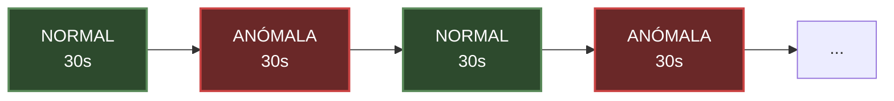
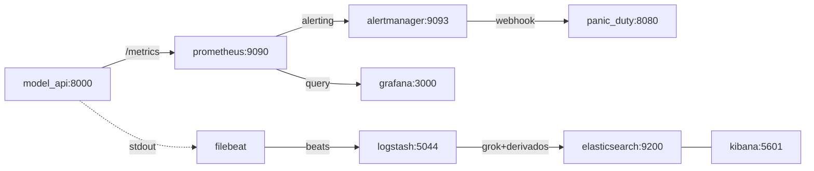

# Demo de Monitoreo ML

Esta guía explica cómo funciona la demo paso a paso, qué observa cada herramienta y por qué, y cómo cada decisión de diseño se conecta con los conceptos del artículo.

---

## Tabla de contenidos

1. [¿Qué simula la demo?](#1-qué-simula-la-demo)
2. [Arquitectura: servicios y cómo se comunican](#2-arquitectura-servicios-y-cómo-se-comunican)
3. [Acceso a cada servicio](#3-acceso-a-cada-servicio)
4. [La API de predicción (model_api)](#4-la-api-de-predicción-model_api)
5. [Prometheus: el colector de métricas](#5-prometheus-el-colector-de-métricas)
6. [Grafana: el dashboard de ML](#6-grafana-el-dashboard-de-ml)
7. [PanicDuty: el receptor de alertas](#7-panicduty-el-receptor-de-alertas)
8. [El pipeline de logs: Filebeat → Logstash → Elasticsearch](#8-el-pipeline-de-logs-filebeat--logstash--elasticsearch)
9. [Kibana: exploración de logs y dashboard](#9-kibana-exploración-de-logs-y-dashboard)
10. [Relación con el artículo](#10-relación-con-el-artículo)

---

## 1. ¿Qué simula la demo?

La demo está inspirada en el artículo [Monitoring Machine Learning Models in Production](https://christophergs.com/machine%20learning/2020/03/14/how-to-monitor-machine-learning-models/) de Christopher GS. La idea central del artículo es que monitorizar un sistema de ML no es lo mismo que monitorizar software tradicional.

Lo que el artículo llama la premisa central — **"una vez que desplegás el modelo, el trabajo recién empieza"** — queda en evidencia acá. El modelo funciona correctamente cuando los datos de entrada se parecen a los datos de entrenamiento. Cuando los datos cambian — aunque el código no cambie — el modelo empieza a producir resultados fuera de rango, con errores, con alta latencia. La demo hace que eso suceda de forma controlada y observable.

El escenario simulado es una **API de predicción de precios de casas** desplegada en producción. No hay un modelo de machine learning real; hay una fórmula determinística que imita el comportamiento de uno. Esto es intencional: permite controlar exactamente qué sale mal y cuándo, para que las herramientas de monitoreo puedan detectarlo.

Se asume que se entrenó un modelo de regresión para estimar precios de casas. El modelo espera tres features de entrada:

- `square_meters` — superficie en metros cuadrados
- `bedrooms` — cantidad de habitaciones
- `neighborhood` — barrio (`suburb`, `downtown`, `rural`, `industrial`)

El modelo fue entrenado con datos donde las casas típicas tienen entre 80 y 260 m², entre 1 y 5 habitaciones, y los barrios se distribuyen entre `suburb` (≈50%), `downtown` (≈25%) y `rural` (≈25%). Es importante notar que el barrio `industrial` **no figura en los datos de entrenamiento** — sólo aparece más tarde, durante las ventanas de anomalía, como ejemplo de categoría desconocida.

### Qué pasa cada 60 segundos

La API alterna automáticamente entre dos modos en ciclos de 60 segundos:



En la ventana **normal**, los datos son representativos del entrenamiento y todo funciona bien.
En la ventana **anómala**, el sistema inyecta problemas reales: inputs fuera de distribución, latencia alta, errores HTTP 500 y features faltantes. Esto dispara alertas en Prometheus y hace visible el deterioro en Grafana y Kibana.

---

## 2. Arquitectura: servicios y cómo se comunican

### Diagrama de flujo

Todos los servicios viven en la misma red Docker `monitor_net` y se ven entre sí por nombre.



### Flujo end-to-end paso a paso

**Núcleo:**

1. Arranca el Model API.
2. Comienza a generar tráfico sintético en segundo plano.
3. Expone métricas a través de `/metrics`.
4. Prometheus hace scraping de esas métricas cada 5 segundos.
5. Grafana lee los datos de Prometheus y renderiza el dashboard.
6. Prometheus evalúa continuamente reglas de alerta.

**Alertas:**

7. Alertmanager recibe las alertas firing desde Prometheus.
8. Alertmanager envía un webhook a PanicDuty.
9. PanicDuty muestra el incidente activo en su interfaz.

**Logs:**

10. El Model API también escribe una línea en texto plano free-form por predicción a stdout (formato tipo `2026-05-01 12:00:00.000 INFO [model_api] req=abc endpoint=/predict status=200 latency=42.10ms ...`).
11. Docker captura stdout en el archivo de log del contenedor.
12. Filebeat lee esos archivos vía autodescubrimiento de Docker y reenvía cada línea (sin parsear) a Logstash en TCP 5044.
13. Logstash parsea el texto plano con `grok` para reconstruir la estructura JSON y normaliza tipos.
14. Logstash envía el documento resultante a Elasticsearch como `model-api-logs-YYYY.MM.DD`.
15. Kibana (UI en el puerto 5601) lee de Elasticsearch y permite filtrar eventos individuales en Discover.

### Tabla de servicios

| Servicio | Imagen / Build | Puerto expuesto | Rol |
|---|---|---|---|
| **model_api** | build local | 8000 | API de predicción + generador de tráfico sintético; expone `/metrics` (scrapeado por Prometheus) y emite logs en texto plano (consumidos por Filebeat) |
| **prometheus** | prom/prometheus:v2.45.0 | 9090 | Recolección de métricas y evaluación de alertas |
| **alertmanager** | prom/alertmanager:v0.25.0 | 9093 | Agrupación y enrutamiento de alertas |
| **panic_duty** | build local | 8080 | Receptor de webhooks de alertas + UI |
| **grafana** | grafana/grafana:10.0.3 | 3000 | Dashboard visual de métricas |
| **elasticsearch** | elastic/elasticsearch:8.17.0 | 9200 | Base de datos de logs |
| **kibana** | elastic/kibana:8.17.0 | 5601 | UI de búsqueda y visualización de logs |
| **logstash** | elastic/logstash:8.17.0 | 9600 (stats API), 5044 (puerto interno, recibe de Filebeat) | Parser de logs + enriquecimiento |
| **filebeat** | elastic/filebeat:8.17.0 | — | Colector de logs de contenedores Docker |
| **kibana-init** | curlimages/curl | — | Crea el data view y carga 2 paneles Lens + 1 dashboard en Kibana (corre una sola vez) |

---

## 3. Acceso a cada servicio

Cuando la demo corre localmente:

| Servicio | URL | Qué podés ver |
|---|---|---|
| **Grafana** (home) | http://localhost:3000 | Página principal de Grafana |
| **Grafana — ML System Dashboard** | http://localhost:3000/d/ml-system | Dashboard de métricas de ML en tiempo real (link directo) |
| **Prometheus** (home) | http://localhost:9090 | Métricas crudas, reglas de alertas, targets |
| **Prometheus Alerts** | http://localhost:9090/alerts | Estado de cada alerta (inactive/pending/firing) |
| **Prometheus Targets** | http://localhost:9090/targets | Estado del scrape (UP/DOWN) hacia la API |
| **Alertmanager** | http://localhost:9093 | Alertas activas agrupadas |
| **PanicDuty** | http://localhost:8080 | UI con alertas disparadas en este momento |
| **API (Swagger UI)** | http://localhost:8000/docs | Documentación interactiva de la API (predict, health, metrics) |
| **Kibana** (home) | http://localhost:5601 | Página principal de Kibana |
| **Kibana — Discover (logs)** | http://localhost:5601/app/discover | Listado de logs parseados con el data view `model-api-logs` (link directo) |
| **Kibana — ML Drift Investigation Dashboard** | http://localhost:5601/app/dashboards#/view/ml-derived-fields-dashboard | Dashboard con 2 paneles Lens (predicciones con missing features, top-20 outlier predictions) |

### Acceso desde un despliegue público

Cuando la demo corre en la nube, las 6 herramientas listadas en el `Caddyfile` (config del reverse proxy Caddy que enruta cada subdominio al servicio interno correspondiente) quedan detrás de subdominios HTTPS con cert de Let's Encrypt automático.

Las URLs apuntan a la Elastic IP del deployment actual (`3-226-31-220` en formato con guiones, que `sslip.io` resuelve por DNS comodín a `3.226.31.220`).

| Servicio | URL pública |
|---|---|
| **Grafana** (home) | [https://grafana.3-226-31-220.sslip.io](https://grafana.3-226-31-220.sslip.io) |
| **Grafana — ML System Dashboard** | [https://grafana.3-226-31-220.sslip.io/d/ml-system](https://grafana.3-226-31-220.sslip.io/d/ml-system) |
| **Prometheus** (home) | [https://prometheus.3-226-31-220.sslip.io](https://prometheus.3-226-31-220.sslip.io) |
| **Prometheus Alerts** | [https://prometheus.3-226-31-220.sslip.io/alerts](https://prometheus.3-226-31-220.sslip.io/alerts) |
| **Prometheus Targets** | [https://prometheus.3-226-31-220.sslip.io/targets](https://prometheus.3-226-31-220.sslip.io/targets) |
| **Alertmanager** | [https://alertmanager.3-226-31-220.sslip.io](https://alertmanager.3-226-31-220.sslip.io) |
| **PanicDuty** | [https://panicduty.3-226-31-220.sslip.io](https://panicduty.3-226-31-220.sslip.io) |
| **API (Swagger UI)** | [https://api.3-226-31-220.sslip.io/docs](https://api.3-226-31-220.sslip.io/docs) |
| **Kibana** (home) | [https://kibana.3-226-31-220.sslip.io](https://kibana.3-226-31-220.sslip.io) |
| **Kibana — Discover (logs)** | [https://kibana.3-226-31-220.sslip.io/app/discover](https://kibana.3-226-31-220.sslip.io/app/discover) |
| **Kibana — ML Drift Investigation Dashboard** | [https://kibana.3-226-31-220.sslip.io/app/dashboards#/view/ml-derived-fields-dashboard](https://kibana.3-226-31-220.sslip.io/app/dashboards#/view/ml-derived-fields-dashboard) |

---

## 4. La API de predicción (model_api)

### Qué es el "modelo"

No hay un modelo de ML real. La "predicción" es esta fórmula:

```python
base_price       = square_meters * 1800
bedroom_adj      = bedrooms * 12000
multiplier       = NEIGHBORHOOD_MULTIPLIERS[neighborhood]
noise            = random.uniform(-15000, 15000)

prediction = (base_price + bedroom_adj) * multiplier + noise
```

Con estos multiplicadores por barrio:

| Barrio | Multiplicador | Interpretación |
|---|---|---|
| `rural` | 0.82 | Las más baratas |
| `suburb` | 1.00 | Referencia base |
| `downtown` | 1.25 | 25% más caro que suburbio |
| `industrial` | 1.55 | Las más caras (zona de alta demanda) |

Una casa de 120 m², 3 habitaciones en `suburb` produce:
```
(120 × 1800 + 3 × 12000) × 1.0 + noise = (216000 + 36000) × 1 + noise ≈ $252,000
```

### El ciclo de anomalía: cómo funciona

La función `is_anomaly_window()` usa aritmética modular sobre el tiempo transcurrido desde el arranque:

```python
ANOMALY_INTERVAL_SECONDS = 30   # tiempo en modo normal
ANOMALY_DURATION_SECONDS  = 30  # tiempo en modo anómalo
cycle_length = 30 + 30 = 60     # ciclo total

def is_anomaly_window() -> bool:
    elapsed = time.monotonic() - app_state["start_time"]
    return (elapsed % 60) >= 30
```

Esto produce una onda cuadrada: los primeros 30 segundos del ciclo son normales, los siguientes 30 son anómalos, y se repite indefinidamente.

### Ventana NORMAL — comportamiento esperado

| Aspecto | Valor |
|---|---|
| `square_meters` | 80–260 m² (distribución pequeña-mediana) |
| `bedrooms` | 1–5 (siempre presente) |
| `neighborhood` | 50% `suburb`, 25% `downtown`, 25% `rural` |
| Latencia extra | ninguna (solo el cómputo base) |
| Tasa de error | 0% |
| Predicciones | ~$113k–$675k (rango razonable) |

### Ventana ANÓMALA — qué se inyecta

| Aspecto | Valor durante anomalía | Por qué es problemático |
|---|---|---|
| `square_meters` | 320–580 m² | Fuera del rango de entrenamiento (80–260 m²) |
| `bedrooms` | None (35% de probabilidad) o `random.randint(1, 7)` | Feature faltante (35%) o fuera del rango de training (1-5) cuando cae en 6-7 |
| `neighborhood` | 75% `industrial` | Barrio inusual (entrenamiento era mayormente `suburb`) |
| Latencia extra | +450 a +850 ms adicionales | La API "se traba" bajo datos anómalos |
| Tasa de error | 70% de requests fallan con HTTP 500 | Errores reales en producción |
| Precio añadido | +$180k a +$420k aleatorio | Las predicciones se disparan |

#### Imputación cuando `bedrooms` llega faltante

Cuando `bedrooms` llega faltante en el request (única feature que se omite en el tráfico sintético, 35% del tiempo durante anomalía), el modelo imputa el hueco con la **mediana del training set** (`bedrooms=3`) y predice normal.

#### Resultado combinado durante la anomalía

```
Predicción anómala = ((sqm_grande × 1800) + (bedrooms × 12000)) × 1.55 + extra
                   = ((450 × 1800) + (3 × 12000)) × 1.55 + 300000
                   ≈ ($810,000 + $36,000) × 1.55 + $300,000
                   ≈ $1,611,000
```

Esto supera el umbral de alerta `PredictionDriftDetected` (> $600,000) en pocos segundos.

### Los tres threads en segundo plano

Cuando la API arranca, lanza tres threads que corren continuamente:

**Thread 1 — `generate_traffic`:** Genera solicitudes sintéticas internas a la propia API al ritmo de `BASE_RPS` (8 solicitudes/segundo por defecto). Esto hace que Grafana tenga datos sin necesidad de que nadie llame a la API externamente.

**Thread 2 — `sample_resources`:** Cada segundo muestrea CPU (`psutil`), memoria RSS y uso de disco, y los publica como Gauges de Prometheus.

**Thread 3 — `auto_bump_version`:** Cada 900 segundos (15 min) simula un "redeploy" del modelo: incrementa la versión, actualiza la métrica `ml_model_info`, y llama a la API de Grafana para crear una anotación visible en el dashboard.

### Formato de logs

La API usa un `PlainTextFormatter` que emite cada evento como una línea de texto libre con pares `clave=valor`. Logstash parsea esas líneas con `grok` y las convierte en documentos estructurados antes de indexarlas en Elasticsearch.

Un log de predicción exitosa se ve así:

```
2025-05-03 12:34:56.789 INFO [model_api] req=a1b2c3d4e5f60718293a4b5c6d7e8f90 endpoint=/predict
status=200 latency=34.12ms model=v1.1.0-demo anomaly=false internal=true
sqm=142 br=3 nbhd=suburb missing=none prediction=267540.50
summary="prediction within expected ranges"
```

Un log de error durante anomalía:

```
2025-05-03 12:35:10.321 ERROR [model_api] req=e5f6g7h8a1b2c3d4e5f6071829a4b5c6 endpoint=/predict
status=500 latency=612.88ms model=v1.1.0-demo anomaly=true internal=true
sqm=452 br=2 nbhd=industrial msg="Prediction failed during an anomaly window.
Anomalous signals: latency was 612ms (typical 15-50ms); square_meters was 452,
unusually large (typical 80-260); neighborhood was 'industrial', unusual
(typical 'suburb' or 'rural'). Cause: Synthetic anomaly triggered while scoring the model."
```

---

## 5. Prometheus: el colector de métricas

Prometheus es el componente que se encarga de las métricas en el stack. El archivo `prometheus.yml` define un único `scrape_config` apuntado a `model_api:8000/metrics` con un `scrape_interval` de **5 segundos**: cada 5s, Prometheus hace un GET a ese endpoint, recibe el dump completo de métricas en formato exposition (text-based key=value), y agrega cada serie temporal con un timestamp del momento del scrape. Sobre esos datos evalúa las reglas de alerta y reenvía a Alertmanager las que disparan.

### Tipos de métricas de Prometheus

Antes de listar las métricas, vale entender los cuatro tipos:

- **Counter:** Solo sube. Cuenta eventos acumulados. Para tasas, se usa `rate()` que calcula la derivada.
- **Gauge:** Sube y baja. Representa un valor instantáneo (CPU%, memoria).
- **Histogram:** Registra observaciones en buckets. Produce tres series: `_count`, `_sum`, y `_bucket`. Permite calcular promedios y percentiles aproximados.
- **Summary:** Similar al Histogram pero calcula percentiles en el cliente (no se usa en la demo).

### Métricas de requests HTTP

| Métrica | Tipo | Labels | Qué mide |
|---|---|---|---|
| `api_requests_total` | Counter | `endpoint`, `http_status` | Total de requests recibidos, distingue por endpoint y código HTTP |
| `api_request_duration_seconds` | Histogram | `endpoint` | Latencia de cada request en segundos |

**Buckets de latencia:** 10ms, 30ms, 50ms, 100ms, 250ms, 500ms, 1s, 2s, 4s

El bucket en 250ms es especialmente útil: si la mayoría de requests cae en ese bucket durante anomalía, confirma que la latencia extra de 450–850ms está afectando a casi todas las llamadas.

### Métricas de predicción

| Métrica | Tipo | Qué mide |
|---|---|---|
| `ml_prediction_value` | Histogram | Distribución de los precios predichos |

**Buckets de precio:** $100k, $150k, $200k, $250k, $300k, $400k, $500k, $650k, $800k, $1M, $1.5M

En modo normal, la mayoría de predicciones cae en los buckets de $200k–$400k. Durante anomalía, se desplazan hacia $800k–$1.5M+. Esto es el **prediction drift** visible en Grafana.

### Métricas de features de entrada

| Métrica | Tipo | Labels | Qué mide |
|---|---|---|---|
| `ml_input_square_meters` | Histogram | — | Distribución de m² de entrada al modelo |
| `ml_input_bedrooms` | Histogram | — | Distribución de habitaciones de entrada |
| `ml_input_neighborhood_total` | Counter | `neighborhood` | Frecuencia de cada barrio en las requests |
| `ml_missing_feature_total` | Counter | `feature` | Cuántas veces faltó cada feature |

Estas métricas son la implementación directa del concepto de **data drift** del artículo: permiten comparar la distribución de inputs actuales con lo que el modelo espera. Si `ml_input_square_meters` muestra que el promedio subió de 160m² a 450m², algo cambió en los datos que llegan.

### Métricas de proceso (sistema operativo)

| Métrica | Tipo | Qué mide |
|---|---|---|
| `model_api_process_cpu_percent` | Gauge | CPU% consumido por el proceso de la API |
| `model_api_process_resident_memory_bytes` | Gauge | Memoria RAM usada (RSS) en bytes |
| `model_api_process_disk_utilization_percent` | Gauge | % de disco usado en el filesystem del contenedor |

Estas son las métricas de **monitoreo operacional** del artículo. Las muestrea el thread `sample_resources` cada 1 segundo usando la librería `psutil`.

### Estadísticas rolling de predicciones

| Métrica | Tipo | Qué mide |
|---|---|---|
| `ml_prediction_mean_recent` | Gauge | Media de predicciones en la ventana de 300s |
| `ml_prediction_median_recent` | Gauge | Mediana de predicciones en la ventana de 300s |
| `ml_prediction_min_recent` | Gauge | Mínimo de predicciones en la ventana de 300s |
| `ml_prediction_max_recent` | Gauge | Máximo de predicciones en la ventana de 300s |
| `ml_prediction_stddev_recent` | Gauge | Desviación estándar de predicciones en la ventana de 300s |

La ventana deslizante de 300 segundos (5 minutos) descarta predicciones antiguas automáticamente. La **desviación estándar** es particularmente útil: durante anomalía sube porque aparecen predicciones extremas de $1M+ mezcladas con predicciones normales, lo que aumenta la dispersión.

### Métricas de identidad del modelo

| Métrica | Tipo | Labels | Qué mide |
|---|---|---|---|
| `ml_model_info` | Gauge | `version`, `trained_at` | 1 si el modelo está activo, 0 si fue retirado |
| `model_deployments_total` | Counter | — | Cantidad de deploys desde que arrancó el servicio |

`ml_model_info` usa un patrón especial: cuando se hace un bump de versión, el label anterior pasa de 1 a 0 y el nuevo pasa a 1. En Grafana, la query `ml_model_info == 1` muestra siempre la versión activa actual.

### Cómo funciona el ciclo de alertas

1. Prometheus evalúa las reglas de `rules.yml` cada **5 segundos**.
2. Si una condición se cumple durante más de `for: 5s`, la alerta pasa a estado **firing**.
3. Prometheus notifica a Alertmanager.
4. Alertmanager agrupa las alertas (espera `group_wait: 5s`), y las envía a PanicDuty vía webhook.
5. Si la alerta sigue activa, Alertmanager la reenvía cada `repeat_interval: 1m`.
6. Cuando la condición deja de cumplirse, Alertmanager envía una notificación de resolución (`send_resolved: true`).

### Las 5 alertas

#### 1. PredictionDriftDetected (CRITICAL)

**Umbral:** $600,000 | **`for`:** 5s

**Por qué este umbral:** En modo normal, las predicciones van de ~$100k a ~$550k. El umbral de $600,000 está un poco por encima del máximo normal, lo que da un margen pequeño sin ser demasiado sensible. Durante anomalía, el promedio rápidamente supera el millón.

**Qué indica:** El modelo está prediciendo precios fuera de su rango habitual. Puede significar data drift (inputs anómalos), concept drift (el mercado cambió), o un bug en el pipeline de datos.

#### 2. HighApiLatency (WARNING)

**Umbral:** 350 ms | **`for`:** 5s

**Por qué este umbral:** La latencia normal es de 15–50ms. El umbral de 350ms es siete veces la latencia máxima esperada. Durante anomalía, la latencia es de 450–850ms, bien por encima. Es `WARNING` (no `CRITICAL`) porque alta latencia es un problema operacional pero no implica pérdida de datos.

**Qué indica:** Inferencia costosa, recursos insuficientes, o inputs que requieren más cómputo del esperado.

#### 3. ElevatedApiErrorRate (CRITICAL)

**Umbral:** 8% de errores | **`for`:** 5s

**Por qué este umbral:** Cero errores es lo esperado. El 8% es un umbral conservador que tolera picos momentáneos sin disparar alertas falsas. Durante anomalía, el 70% de requests falla — muy por encima del umbral.

**Qué indica:** La API está fallando. En producción real, esto significa que clientes están recibiendo errores. Es `CRITICAL` porque tiene impacto directo en usuarios.

#### 4. MissingFeatureSpike (WARNING)

**Umbral:** 0.5 features faltantes por segundo | **`for`:** 5s

**Por qué este umbral:** En modo normal, todas las features llegan completas: la tasa es 0. El umbral de 0.5/s es prácticamente "más de una feature faltante en 2 segundos". Durante anomalía, con 8 RPS y 35% de probabilidad de `bedrooms` faltante, la tasa es ~2.8/s.

**Qué indica:** El pipeline de datos upstream está enviando datos incompletos. En producción, esto suele significar un cambio en el sistema que genera los datos de entrada.

#### 5. ModelApiTargetDown (CRITICAL)

**Umbral:** 0 (API inaccesible) | **`for`:** 5s

**Por qué este umbral:** Binario. Si Prometheus no puede hacer el scrape, el servicio está caído. Es la alerta más grave de todas.

**Qué indica:** El contenedor `model_api` no responde. En producción, esto significa que ningún cliente puede obtener predicciones.

### Resumen de alertas que disparan durante anomalía

| Alerta | ¿Dispara en anomalía? | Por qué |
|---|---|---|
| PredictionDriftDetected | ✓ Sí | Predicciones superan $600k |
| HighApiLatency | ✓ Sí | Latencia 450–850ms > 350ms |
| ElevatedApiErrorRate | ✓ Sí | 70% de errores > 8% |
| MissingFeatureSpike | ✓ Sí | 35% de bedrooms faltantes → ~2.8/s > 0.5/s |
| ModelApiTargetDown | ✗ No | La API sigue respondiendo (solo falla lógica, no el proceso) |

### Conexión con Alertmanager

Prometheus no notifica fuera del stack por sí solo. Cuando una alerta llega a `firing`, Prometheus hace un POST a Alertmanager (configurado en `alertmanager.yml`). En la demo, Alertmanager tiene un único receptor configurado: el webhook de PanicDuty en `http://panic_duty:8080/webhook`. PanicDuty entonces renderiza la alerta en su UI (ver la [sección 7](#7-panicduty-el-receptor-de-alertas) más abajo).

---

## 6. Grafana: el dashboard de ML

El dashboard "ML System Dashboard" se refresca cada **5 segundos** y muestra una ventana temporal de los últimos **15 minutos**. Está dividido en tres secciones.

### Sección 1 — Alert Status Overview

Seis tarjetas grandes (stat panels) que funcionan como **semáforos**: verde cuando todo está bien, rojo cuando se supera el umbral.

#### House Price Predictor (UP / DOWN)

Muestra si Prometheus puede alcanzar la API. `1 = UP (verde)`, `0 = DOWN (rojo)`. Es el indicador más básico de disponibilidad. En condiciones normales siempre está verde; solo se pondría rojo si el contenedor `model_api` cayera.

#### Predict Latency

Latencia promedio del endpoint `/predict` en los últimos 15 segundos. **Umbral: 0.35 segundos.** Verde por debajo, rojo por encima. Durante anomalía, la latencia salta a 0.45–0.85s y este panel se pone rojo.

#### Predict Error Rate

Fracción de requests a `/predict` que terminan en HTTP 500. **Umbral: 8%.** Durante anomalía, el 70% de requests falla, por lo que este panel se pone rojo claramente.

#### Process CPU

CPU promedio del proceso en los últimos 15s. **No tiene alerta asociada** — es una métrica de monitoreo operacional (saber qué consume el proceso), no un disparador. En la práctica se mantiene baja (~1–10%) durante toda la corrida; la API hace cómputo trivial por request, así que no hay spike notable durante anomalías. En un sistema real este panel sería el primer lugar a mirar si la latencia subiera sin causa obvia.

#### Missing Features

Tasa de features faltantes por segundo. **Umbral: 0.5/s.** Durante anomalía, `bedrooms` llega como `None` en el 35% de los requests. Con 8 requests/segundo, eso da ~2.8 features faltantes/segundo — muy por encima del umbral.

#### Avg Prediction

Precio promedio predicho en los últimos 15 segundos. **Umbral: $600,000.** Durante anomalía el promedio supera el millón de dólares, activando este semáforo en rojo.

### Sección 2 — DevOps Metrics

Gráficas de series de tiempo con líneas de umbral visibles (área roja):

- **Predict Request Rate:** Solicitudes por segundo a `/predict`. Debería mantenerse estable ~8 RPS (el rate base del generador de tráfico).

- **Predict Latency:** La misma latencia promedio del stat panel pero como serie histórica. Se puede ver claramente la onda cuadrada: baja durante ventana normal, sube durante anomalía.

- **Predict Error Rate:** Porcentaje de errores a lo largo del tiempo. La línea roja horizontal marca el 8%.

- **Process CPU:** CPU% a lo largo del tiempo.

- **Process Memory:** Memoria RSS en bytes. Debería ser relativamente estable.

- **Disk Utilization:** Porcentaje de uso del disco del contenedor.

### Sección 3 — ML Metrics

Esta sección contiene los paneles específicos de machine learning, que no existen en un stack de monitoreo convencional.

#### Model Identity

Muestra el label `version` del modelo activo actualmente. Cada vez que el thread `auto_bump_version` simula un deploy (cada 900s, es decir 15 min), el panel actualiza la versión. Las versiones siguen el formato `1.0.0-demo`, `1.1.0-demo`, ..., `2.0.0-demo`.

#### Prediction Mean (serie de tiempo)

Evolución de la media de predicciones. La línea roja está en $600,000. Durante anomalía, se ve el salto brusco en la gráfica.

#### Prediction Median, Min/Max, StdDev

Estas cuatro métricas vienen de los Gauges rolling-window (`ml_prediction_median_recent`, etc.). Son especialmente útiles para distinguir un aumento real del promedio de un aumento por outliers: si la **mediana** sube junto con la **media**, casi todas las predicciones están siendo anómalas. Si solo sube la media pero la mediana se mantiene, son unos pocos outliers.

La **desviación estándar** es el indicador más sensible del inicio de la anomalía: empieza a subir antes que el promedio, porque los primeros requests anómalos crean dispersión antes de que el promedio se desplace.

#### Prediction Histogram Buckets

Un gráfico de barras (bar gauge) que muestra cuántas predicciones cayeron en cada rango de precio en el último minuto. 11 buckets:

```
$100k–$150k | $150k–$200k | $200k–$250k | ... | $800k–$1M | $1M–$1.5M | >$1.5M
```

Durante operación normal, la mayoría de las barras están en los buckets de $200k–$400k. Durante anomalía, las barras se desplazan drásticamente hacia la derecha, haciendo visible el **prediction drift** de forma intuitiva.

#### Square Meters Mean y Bedrooms Mean (series de tiempo)

Dos paneles timeseries que grafican el promedio de cada feature numérica de entrada. Sirven como vista resumida del drift de inputs antes de mirar el histograma: durante anomalía, la curva de `Square Meters Mean` se dispara de ~170 m² (promedio normal) a ~450 m², y `Bedrooms Mean` baja un poco por la combinación de `None` (35%) más el rango ensanchado (1-7). Útiles para correlacionar visualmente con la curva de `Prediction Mean` del row de arriba.

#### Input Histograms

Dos histogramas para las features numéricas de entrada:
- `ml_input_square_meters` (9 buckets de 50 a >650 m²)
- `ml_input_bedrooms` (9 buckets de 0 a >8)

El histograma de `square_meters` es especialmente revelador: en modo normal las barras están concentradas en los buckets de 80–260 m². Durante anomalía, las barras saltan a 320–580 m². Esto es **data drift** visualizado directamente.

#### Neighborhood Mix (serie de tiempo por barrio)

`ml_input_neighborhood_total` es un **Counter** con un label por barrio. El panel grafica el rate por barrio, así se ve la mezcla de tráfico por categoría a lo largo del tiempo.

La señal a buscar acá es la **aparición** de la línea de `industrial`. En modo normal `industrial` no debería existir (la API solo emite `suburb`/`downtown`/`rural`); durante anomalía empieza a aparecer.

#### Missing Features (serie de tiempo)

Muestra qué feature específica falta, desglosada por label. En la demo solo `bedrooms` puede llegar como `None` (durante anomalía con 35% de probabilidad), así que es el único label que aparece.

### Anotaciones de deploy

Cada vez que se simula un redeploy (cada 900 segundos, es decir 15 min), aparece una línea vertical en el dashboard. Estas anotaciones permiten **correlacionar** cambios de comportamiento con cambios de versión: "¿El error rate subió después del deploy de v1.3.0?" Esto implementa la recomendación del artículo de versionar modelos y registrar deploys.

---


## 7. PanicDuty: el receptor de alertas

### Qué es

PanicDuty es una **versión simplificada de PagerDuty**: un sistema de on-call que recibe notificaciones de alertas y las presenta a los operadores. En la demo es un servicio de construcción propia (FastAPI + Jinja2) que actúa como stand-in pedagógico.

### Qué hace la aplicación

**`POST /webhook`:** Recibe el payload. Para cada alerta en el array:
- Si `status == "firing"` y la alerta no está ya registrada → la agrega a `active_alerts`
- Si `status == "resolved"` → la elimina de `active_alerts`

**`GET /`:** Renderiza una página HTML con la lista de `active_alerts` actuales.

---

## 8. El pipeline de logs: Filebeat → Logstash → Elasticsearch

### Por qué un pipeline de logs además de Prometheus

Prometheus mide **agregados**: el promedio de latencia, el total de errores. Los logs registran **eventos individuales**: qué features tuvo exactamente el request que falló, cuál fue el request_id, qué barrio específico llegó en la predicción anómala. Son complementarios.

El artículo menciona que los sistemas de logging para ML deben permitir rastrear predicciones individuales y sus inputs para análisis posterior. Este pipeline implementa exactamente eso.

### Paso 1: Filebeat — colección de logs

Filebeat es un agent liviano de Elastic cuyo único trabajo es shipear logs al stack.

Existe porque centralizar logs desde múltiples máquinas/contenedores requiere un shipper confiable que maneje rotación de archivos, lecturas parciales, backpressure cuando el destino está saturado, y reintentos. Sin un shipper, cada servicio tendría que conocer dónde mandar sus logs y cómo manejar fallas de red — lo que rompe la separación de responsabilidades.

En la demo, Filebeat lee los logs que `model_api` emite a stdout y envía los eventos al puerto 5044 de Logstash usando el protocolo Beats: una codificación binaria (más compacta y rápida de parsear que JSON) con confirmaciones por batch que permiten frenar al shipper cuando Logstash está saturado, sin perder eventos.

### Paso 2: Logstash — parsing

Logstash recibe los eventos de Filebeat y los procesa.

#### Parsing con Grok

Grok es un lenguaje de patrones para parsear texto libre. Logstash matchea cada línea contra dos patrones alternativos: uno para predicciones exitosas (incluye `prediction` y `summary`) y otro para predicciones fallidas (incluye `msg` con el detalle del error).

Después del grok, Logstash reestructura los campos a un formato anidado (`features.square_meters`, `features.bedrooms`, `features.neighborhood`), convierte tipos donde corresponde (`anomaly_window` y `internal` a boolean), y reconstruye `missing_features` como array splitteando por coma. El campo `event_type` se deriva del nivel del log (`INFO` → `prediction`, `ERROR` → `prediction_failed`).

Iteraciones anteriores de la demo agregaban acá campos derivados (categorización de latencia, flag de drift de inputs, clasificación regex de errores). Se eliminaron porque las mismas queries se logran sin precómputo: `latency_ms >= 500`, `features.square_meters > 300` o filtros sobre `error_message` directamente en KQL. Logstash queda solo con su rol clásico — parsear texto plano a JSON estructurado.

### Paso 3: Elasticsearch — almacenamiento

Logstash envía los documentos a Elasticsearch con el índice `model-api-logs-{fecha}` (un índice por día).

---

## 9. Kibana: exploración de logs y dashboard

### Cómo explorar los logs en Kibana

Cada predicción que pasa por la API queda registrada en Elasticsearch como un documento JSON con todo el contexto del request: features de entrada, predicción de salida, latencia, versión del modelo, request_id, timestamp, ventana de anomalía y, cuando aplica, lista de features faltantes y mensaje de error. Kibana permite explorar ese stream evento por evento desde la vista **Discover**, con el data view `model-api-logs` ya seleccionado por defecto. La búsqueda usa KQL (Kibana Query Language), una sintaxis simple que combina campo + operador + valor, con soporte para boolean (`AND`, `OR`, `NOT`), comparadores numéricos (`>`, `<`, `>=`) y wildcards (`*`).

Ejemplos de queries:

- `anomaly_window: true` → solo logs durante ventana anómala
- `event_type: prediction_failed` → solo errores
- `missing_features: *` → requests donde alguna feature llegó faltante
- `features.neighborhood: industrial` → requests con barrio industrial
- `latency_ms > 400` → requests muy lentos
- `prediction > 1500000` → predicciones extremas

### Dashboard auto-provisionado

El dashboard se llama **"ML Drift Investigation"** y tiene **dos paneles**. Se carga automáticamente al iniciar la demo vía `kibana-init`.

#### Panel 1 — Distribución de predicciones cuando faltan features

**Tipo:** Lens histogram (`lnsXY` con bar chart, `maxBars: 10`)
**Filtro:** `missing_features: *` (eventos donde el array `missing_features` no está vacío)
**Muestra:** distribución del campo `prediction` para esos eventos.

**Qué se ve en el demo:** durante operación normal, panel vacío (no hay missing). Durante anomalía, histograma con barras concentradas en $1.4M-$1.8M — esas son las predicciones que se generaron con `bedrooms=3` (mediana del training set) en lugar del valor real.

#### Panel 2 — Top-20 predicciones extremas con full feature context

**Tipo:** Lens datatable (`lnsDatatable`, `customLabel: true` en cada columna)
**Sin filtro** — toma todos los eventos
**Muestra:** tabla con 20 filas, ordenada por `prediction` descendente. Columnas: `request_id`, `prediction`, `features.square_meters`, `features.bedrooms`, `features.neighborhood`, `latency_ms`, `model_version`, `@timestamp`.

**Qué se ve en el demo:** durante anomalía, las 20 filas son todas predicciones $1.5M-$2.18M con `features.neighborhood = industrial`, `features.square_meters > 400`, latencia 600-800ms. Cada fila es un drilldown completo: con `request_id` podés correlacionar con otros sistemas, con el feature context entendés exactamente por qué esa request generó una predicción extrema.

#### Por qué los dos paneles son distintos entre sí

- **Panel 1** se enfoca en eventos donde algo **faltó en el input** (missing_features) — análisis de calidad de datos upstream.
- **Panel 2** se enfoca en eventos con **predicción extrema** — análisis post-alerta de la cola de distribución.

La intersección entre los dos sets es chica: las predicciones imputadas (~$1.4M-$1.8M) generalmente no son los outliers absolutos (que llegan a $2M+ con todas las features presentes). Por eso ambos paneles complementan distintos ángulos del comportamiento del modelo.

---

## 10. Relación con el artículo

**Referencia:** [Christopher, G. S. (2020). *Monitoring Machine Learning Models in Production.*](https://christophergs.com/machine%20learning/2020/03/14/how-to-monitor-machine-learning-models/)

### La premisa central

El artículo parte de que los modelos de ML, a diferencia del software tradicional, **pueden degradarse silenciosamente**. Un programa de software tiene comportamiento determinístico; si el código no cambia, el comportamiento no cambia. Un modelo de ML produce predicciones basadas en patrones estadísticos aprendidos de datos históricos. Cuando los datos reales se alejan de esos datos históricos, el modelo empieza a fallar — sin que nadie cambie una línea de código.

La demo hace esto explícito: el "código" (la fórmula) nunca cambia, pero los inputs cambian dramáticamente cada 30 segundos, y el sistema entero se ve afectado. Es la diferencia entre los **3 ejes** del software tradicional (sólo código + configuración) y los **3 ejes** del software de ML (código + modelo + datos), donde los datos cambian solos. El paper "Hidden Technical Debt in Machine Learning Systems" (Sculley et al., 2015) bautiza esta interdependencia como **CACE** (*Changing Anything Changes Everything*): cambiar una feature de entrada altera la importancia de todas las demás.

### CD4ML: dónde se sitúa la demo

El artículo enmarca el monitoreo dentro del ciclo CD4ML (*Continuous Delivery for ML*) de Martin Fowler: creación → evaluación → productivización → testing → despliegue → **monitoreo**. La demo cubre exactamente la última etapa, la que cierra el loop y debería retroalimentar a las anteriores. En un sistema real, una alerta de `PredictionDriftDetected` debería disparar un análisis que devuelva al equipo de DS a las primeras etapas (re-entrenamiento con datos recientes). Acá el bump automático de versión cada 15 min simula ese cierre del loop sin reentrenamiento real.

### Las 3 fallas del artículo y cómo la demo las simula

El artículo agrupa las fallas de modelos en producción en tres categorías:

| Falla del artículo | Cómo se simula en la demo | Cómo se detecta |
|---|---|---|
| **Data skew** (los datos en producción no son los del training) | Ventana de anomalía cambia rangos de features (`square_meters` salta a 320–580, aparece `industrial`) | Histogramas de inputs en Grafana + queries KQL en Kibana sobre `features.*` |
| **Model staleness** (el mundo cambia, el modelo se queda viejo) | Bumps de versión cada 15 min (annotations turquesas en Grafana) muestran cómo se vería un re-deploy regular | `ml_model_info` + annotations |
| **Negative feedback loops** (el modelo contamina sus propios datos de re-entrenamiento) | **NO se simula** — requeriría un pipeline de re-entrenamiento real | — |

### Los 7 monitores de Breck et al. (Google, 2017)

El artículo cita el paper "ML Test Score" como la referencia más completa de qué monitorear. Mapeo monitor por monitor:

| Monitor | Descripción | Implementación en la demo |
|---|---|---|
| **M1** | Cambios en dependencias de datos generan notificaciones | No implementado (la demo es un solo servicio) |
| **M2** | Las invariantes de datos se mantienen (training-vs-serving) | KQL en Kibana sobre `features.*` para detectar valores fuera de rango + grok rejection con `_grokparsefailure` |
| **M3** | **Training-serving skew** — features de training y serving computan los mismos valores | No implementado. Según Breck, **es el más crítico y el menos implementado en la industria** |
| **M4** | El modelo no está demasiado desactualizado | Annotations de deploy en Grafana (`POST /api/annotations`) marcan cada bump de versión |
| **M5** | El modelo es numéricamente estable (sin NaN/inf/overflow) | No implementado (la fórmula no produce esos casos) |
| **M6** | Sin regresiones drásticas en latencia, throughput, RAM | DevOps row de Grafana (Predict Latency/Request Rate, Process CPU/Memory) + alertas `HighApiLatency`, `ElevatedApiErrorRate` |
| **M7** | Sin regresión en calidad de predicción sobre datos servidos | `PredictionDriftDetected` (`ml_prediction_value` mean > $600k) + `MissingFeatureSpike` |

### Las dos perspectivas del monitoreo

El paper unifica dos perspectivas históricamente separadas en equipos distintos. La demo las pone en un mismo dashboard intencionalmente.

#### Monitoreo Operacional (perspectiva DevOps)

Métricas que miden la salud del **sistema**, no del modelo:

| Concepto del artículo | Implementación en la demo | Dónde se ve |
|---|---|---|
| Latencia | `api_request_duration_seconds` | Grafana — Predict Latency |
| Throughput | `api_requests_total` rate | Grafana — Predict Request Rate |
| Uso de CPU | `model_api_process_cpu_percent` | Grafana — Process CPU |
| Uso de memoria | `model_api_process_resident_memory_bytes` | Grafana — Process Memory |
| Disponibilidad | `up{job="house_price_predictor"}` | Grafana — House Price Predictor stat |
| Tasa de error | HTTP 500 / total requests | Grafana — Predict Error Rate |

#### Monitoreo ML (perspectiva Data Science)

Métricas que miden la salud del **modelo** y sus datos:

| Concepto del artículo | Implementación en la demo | Dónde se ve |
|---|---|---|
| Data drift | Histogramas de `square_meters`, `bedrooms`, `neighborhood` | Grafana — ML Metrics section |
| Data skew "feature unavailable" (artículo sección 3 item 2) | `missing_features:*` filtra eventos con feature faltante; el modelo imputa con la mediana del training set (`bedrooms=3`) | Kibana — panel **Predicciones con missing features** del dashboard `ML Drift Investigation` |
| Prediction drift | `ml_prediction_value` + alerta `PredictionDriftDetected` | Grafana — Prediction Mean, stat panels |
| Calidad de features | `ml_missing_feature_total` + alerta `MissingFeatureSpike` | Grafana — Missing Features |
| Distribución de predicciones | Histogram buckets de `ml_prediction_value` | Grafana — Prediction Histogram Buckets |
| Estadísticas rolling | `ml_prediction_mean/median/stddev_recent` | Grafana — ML Metrics section |
| Versionado de modelos | `ml_model_info` + anotaciones Grafana | Grafana — Model Identity + líneas verticales |
| Drill-down post-alerta sobre cola de predicciones (artículo sección 6) | Top-20 predicciones extremas con `request_id`, `features.*`, `latency_ms`, `model_version`, `@timestamp` | Kibana — panel **Top-20 predicciones extremas** del dashboard `ML Drift Investigation` |

### Sin ground truth: monitorear proxies

La demo no tiene ground truth — no sabemos el "precio real" de cada casa. Es exactamente el escenario más común en producción real (detección de fraude, riesgo crediticio, predicción de enfermedad: el ground truth llega meses después o nunca). Sin ground truth no se puede medir accuracy directamente, así que se monitorean **proxies estadísticos**:

- **Distribución de predicciones**: histogramas de `ml_prediction_value` en Grafana. Si se desplazan, algo cambió.
- **Distribución de features de entrada**: histogramas de `ml_input_square_meters`, `ml_input_bedrooms` y counter `ml_input_neighborhood_total`.
- **% de valores nulos por feature**: `ml_missing_feature_total{feature=...}`.
- **Versión del modelo desplegada**: `ml_model_info` con label `version`.

Estos cuatro proxies son los que el paper recomienda explícitamente cuando no hay accuracy en vivo. La demo los implementa todos.

### Observabilidad: 2 de los 3 pilares

El paper distingue **monitoreo** (detectar fallas predecibles) de **observabilidad** (responder cualquier pregunta sobre el sistema desde afuera). La demo es 100% monitoreo: las 5 alertas detectan condiciones predefinidas. La observabilidad emerge cuando alguien usa Kibana Discover para investigar un caso anómalo no anticipado por las alertas — por ejemplo, filtrar por `features.square_meters > 300 AND latency_ms < 50` para encontrar requests con drift de input pero sin latencia (un gap que ninguna alerta cubre).

De los 3 pilares de observabilidad (métricas, logs, trazas distribuidas), la demo cubre los dos primeros con Prometheus y ELK. **Las trazas distribuidas no se implementan**: con un solo servicio (model_api), las trazas no aportan información adicional. En un sistema real con varios microservicios (API gateway → auth → feature store → model serving → caching → response), las trazas serían el tercer pilar imprescindible.

### Cardinalidad: por qué métricas para predicciones y logs para inputs categóricos

El paper introduce una sutileza fundamental: las métricas (Prometheus) tienen problemas de **alta cardinalidad**. Si usás IDs de usuario o categorías con miles de valores como labels, sobrecargás la TSDB. Por eso:

- Las **predicciones** (numéricas, agregables, baja cardinalidad implícita): van a métricas. `ml_prediction_value` es un Histogram con ~13 buckets fijos.
- Las **features categóricas con cardinalidad acotada** (`neighborhood` con 4 valores): pueden ir como label de counter (`ml_input_neighborhood_total{neighborhood=...}`).
- Las **features de alta cardinalidad** (texto libre, IDs, descripciones): obligatoriamente a logs.

Esto justifica el stack dual de la demo: Prometheus + ELK no es redundante, cada uno cubre una clase distinta de cardinalidad.

### El panorama cambiante

El paper es de marzo de 2020 y se nota. La demo deliberadamente implementa el stack "vintage" del paper (Prometheus + Grafana + ELK + alerting custom) para mostrar los conceptos sin la magia de productos especializados. Pero en 2026 hay alternativas, la demo sigue siendo válida pedagógicamente porque enseña los **conceptos** (data drift, prediction drift, observability gap, cardinalidad, los 3 pilares) que cualquier herramienta moderna implementa por debajo. Una vez entendidos los conceptos, cambiar el stack es una decisión de ingeniería, no un cambio mental.
